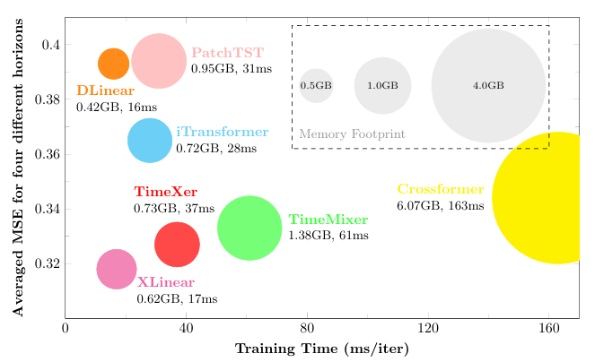
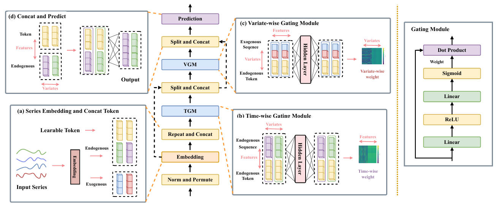
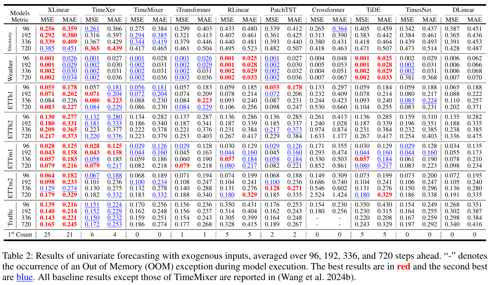
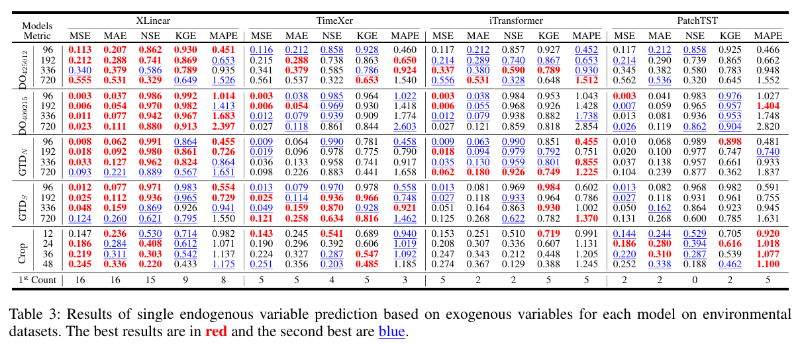
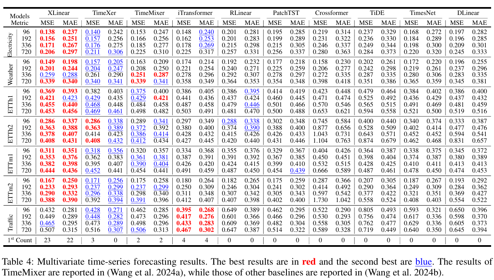
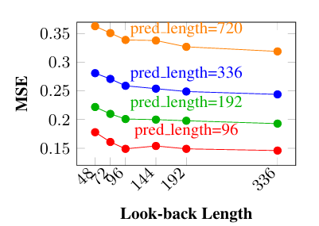
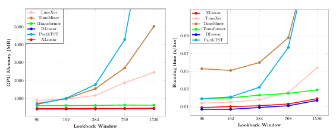

# XLinear: A Lightweight and Accurate MLP-Based Model for Long-Term Time Series Forecasting with Exogenous Inputs

### Introduction
---
This paper aims to bridge the gap between efficiency and accuracy in time series forecasting, particularly in scenarios involving exogenous inputs. A feature-filtering gating module composed of MLP and sigmoid is constructed for this purpose. Furthermore, we leverage global tokens extracted from endogenous sequences to filter valid information from exogenous input sequences. The proposed method achieves state-of-the-art performance on 7 benchmark datasets and 5 real-world datasets with external inputs; meanwhile, compared with mainstream Transformer-based models, it exhibits a 30% improvement in running speed.
<div align="center">
  
</div>

### Overall Arctictrue
---
XLinear comprises merely two sets of gating modules with identical structures, which are employed to capture temporal dimension features of endogenous variables and effective information in exogenous variables respectively. To prevent information interference between different dimensions, we draw on the approach in TimeXer for learning global representations for endogenous variables to bridge the information of these two dimensions.
<div align='center'>
  
</div>

### Usage
---
1.Datasets can be obtained via the following links: 
[ETT](https://github.com/zhouhaoyi/ETDataset)
[Weather](https://www.bgc-jena.mpg.de/wetter/)
[Electricity](https://archive.ics.uci.edu/dataset/321/electricityloaddiagrams20112014)
[Traffic](https://pems.dot.ca.gov/)
[Crop](https://www.kaggle.com/datasets/ajithdari/crop-yield-prediction)
[DO_409202](http://data.water.vic.gov.au/WMIS/)
[DO_425012](realtimedata.waternsw.com.au/water.stm)

2.Install Pytorch and other necessary dependencies.
```bash
pip install -r requirements.txt
```

3.All dataset scripts are centralized in the `script` folder. Execute the following startup commands in the main directory. Examples are as follows:
```bash
bash ./script/multi_forcasting/etth1.sh
```

### Main Results
---
We conducted a systematic evaluation of XLinear on 7 benchmark datasets and 5 environmental datasets. The results demonstrate that the model can accurately capture temporal dimension features and variable dimension features in time series while maintaining high operational efficiency, and accomplish the forecasting task through a mechanism of synergistic integration of these two types of features.

Forcasting with Exogenous
<div align='center'>
  
  
</div>

Multivariate Forcasting
<div align='center'>
  
</div>

### Model Analysis
---
We investigated the impact of changes in the lookback window on model performance and operational efficiency.
<div align='center'>
  
</div>
<div align='center'>
  
</div>
